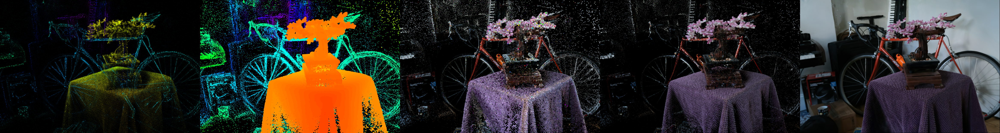
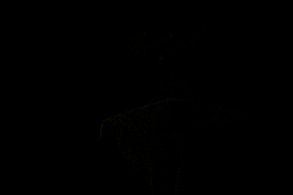
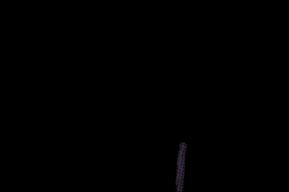

> *The world's slowest 3D Gaussian Splatting renderer... built that way on purpose.*


**splaty** is a deliberately slow, crystal-clear Python implementation of a 3D Gaussian Splatting renderer designed for learning. No GPU acceleration. No CUDA kernels. No performance tricks obscuring the algorithm. Just pure Python and PyTorch, making every single step explicit and understandable.

This isn't about not knowing how to optimize—it's about recognizing that **teaching tools have different requirements than production code**. When you're trying to understand a complex algorithm, the last thing you need is layers of optimization obscuring the core ideas. Sometimes the best way to learn is to slow down and see every step clearly.

## 📝 Blog Series

This repository is the official companion to my Medium series on building a 3D Gaussian Splatting renderer from scratch:

| Part | Title | Link |
|------|-------|------|
| **Part 1** | I Built the Slowest 3D Gaussian Splatting Renderer... On Purpose | [Blog Post](https://medium.com/ai-advances/i-built-the-slowest-3d-gaussian-splatting-renderer-on-purpose-a8170b90d9b4?sk=0a2c1a32a01f0cfb3c9050f7c045483f) |
| **Part 2** | Circles Are Not Gaussians (But Let's Pretend They Are) |  [Blog Post](https://medium.com/ai-advances/circles-are-not-gaussians-but-lets-pretend-they-are-7bcf6db6efb8?sk=a4a27e16d71f4c1742b8ec6f45550673) |
| **Part 3** | Splat Your Own Gaussians: Covariance, Ellipses, and Real 2D Projection | [Blog Post](https://medium.com/ai-advances/splat-your-own-gaussians-from-circles-to-ellipses-96b69f1e7e3f?sk=cc15df35d8dfbb381eae69a1f44db4f7) |
| **Part 4** | The Tricks That Make Production 3DGS Fast (Even If Ours Isn't) | [Blog Post](https://medium.com/ai-advances/the-tricks-that-make-production-3dgs-fast-even-if-ours-isnt-6cd9928ec307?sk=0342cf93adb6faf269fd6ecf973915cb) |

Each blog post walks through the theory and implementation details for one stage of the renderer. The code here implements everything discussed in the series.

## 🎯 Why This Project Exists

Most 3D Gaussian Splatting implementations are optimized for performance, which can make them harder to learn from. The math is often in CUDA kernels, operations are batched and parallelized, and you need to know what you're looking for.

**splaty takes a different approach:** clarity over speed. Operations are explicit, transformations are visible, and the blog series walks through the implementation step by step.

## 🛠️ Installation

### Prerequisites
This project uses [pixi](https://pixi.sh/) for environment management and task running to keep things simple. Install pixi following the [official instructions](https://pixi.sh/latest/#installation).

### Clone the Repository
Note that this repo uses git submodules (for gsplat integration), so clone with:

```bash
git clone --recurse-submodules https://github.com/sascha-kirch/splaty.git
cd splaty
```

> [!TIP]
> If you already cloned without `--recurse-submodules`, run:
> ```bash
> git submodule update --init --recursive
> ```

### Install Dependencies

Install gsplat and its dependencies (including a patch to dump scene normalization info):

```bash
pixi run gsplat-setup
```

> [!WARNING]
> Make sure you have initialized recursive submodules before running gsplat setup, or it will fail.

### Download the Test Dataset

Download the MipNeRF-360 dataset (the bonsai scene used throughout the series):

```bash
pixi run gsplat-download-data
```

### Train the Scene with gsplat

Train a 3D Gaussian Splatting scene that you can then render with splaty:

```bash
# Train on bonsai scene (data factor 4, 30k iterations)
pixi run 3dgs-bonsai

# Visualize the trained model interactively (optional)
pixi run visualize-bonsai
```

> [!WARNING]
> To train a scene with gsplat, you need a CUDA-capable GPU with sufficient memory. You can adjust the `--data_factor` and `--num_iterations` parameters in the task definition to fit your hardware.

> [!TIP]
> I pre-defined the tasks for 3 scenes, so you can either choose between bonsai, kitchen or bicycle or use it as a template to define your own task. Available tasks can be visualized with `pixi task list -s` or directly in [pyproject.toml](pyproject.toml).

That's it! You're ready to render.

## 🎨 Usage

### Rendering with splaty

The repository implements six progressive stages of rendering. Use these pre-configured tasks to render each stage and see the results:

| Example Output | Command | Blog Post |
|----------------|---------|-----------|
| **Stage 1**<br>Means colored by depth<br>  | `pixi run render-means-full` | [Part 1](https://medium.com/ai-advances/i-built-the-slowest-3d-gaussian-splatting-renderer-on-purpose-a8170b90d9b4?sk=0a2c1a32a01f0cfb3c9050f7c045483f) |
| **Stage 2**<br>Circles colored by depth <br>  | `pixi run render-circles-full` | [Part 2](https://medium.com/ai-advances/circles-are-not-gaussians-but-lets-pretend-they-are-7bcf6db6efb8?sk=a4a27e16d71f4c1742b8ec6f45550673) |
| **Stage 3**<br>Circles with spherical harmonics <br>  | `pixi run render-circles-sh-full` | [Part 2](https://medium.com/ai-advances/circles-are-not-gaussians-but-lets-pretend-they-are-7bcf6db6efb8?sk=a4a27e16d71f4c1742b8ec6f45550673) |
| **Stage 4**<br>Circles with SH and alpha blending <br>  | `pixi run render-circles-alpha-full` | [Part 2](https://medium.com/ai-advances/circles-are-not-gaussians-but-lets-pretend-they-are-7bcf6db6efb8?sk=a4a27e16d71f4c1742b8ec6f45550673) |
| **Stage 5**<br>Gaussian splats with full rendering <br>  | `pixi run render-splats-alpha-quarter` | [Part 3](https://medium.com/ai-advances/splat-your-own-gaussians-from-circles-to-ellipses-96b69f1e7e3f?sk=cc15df35d8dfbb381eae69a1f44db4f7) |
| **Stage 6a**<br>Splats with transmittance/conics <br>  | `pixi run render-splats-transmittance-quarter` | [Part 4](https://medium.com/ai-advances/the-tricks-that-make-production-3dgs-fast-even-if-ours-isnt-6cd9928ec307?sk=0342cf93adb6faf269fd6ecf973915cb) |
| **Stage 6b**<br>Splats with tiling (very slow!) <br>  | `pixi run render-splats-tiled-quarter` | [Part 4](https://medium.com/ai-advances/the-tricks-that-make-production-3dgs-fast-even-if-ours-isnt-6cd9928ec307?sk=0342cf93adb6faf269fd6ecf973915cb) |

> [!WARNING]
> When I said this renderer is slow, I meant it! Stages 5-6 can take several hours depending on how many gaussians the scene has and in which resolution you want to render at. Grab a coffee and watch the progress.

> [!TIP]
> **Custom Configs**: The pre-defined tasks use the default config from `render_image.py`. To use a different config simply append `--config-name <NAME>`, e.g.: `pixi run render-means-full --config-name kitchen`

**Outputs are saved to:** `./outputs/`

### Configuring Custom Cameras

To render from different viewpoints, edit the config files in `config/` (e.g., [config/bonsai.yaml](config/bonsai.yaml)).

You can either:
1. **Define custom camera parameters** manually
2. **Extract camera parameters from COLMAP** training data:

```bash
pixi run colmap-convert-bonsai
```

This converts the COLMAP binary model to text format in `data/360_v2/bonsai/sparse/`. The text files include headers explaining each parameter. See the [COLMAP documentation](https://colmap.github.io/format.html#text-format) for details.

**Important:** gsplat normalizes scenes during training. The patch we applied during installation dumps the normalization transformation to `transform.txt` in the output directory. Copy this transformation into your config to properly undo the normalization (as explained in the blog series).

## 👥 Who Is This For?

This project is for anyone who wants to understand how 3D Gaussian Splatting works under the hood. If you've read about it or used existing implementations and want to see the details, this might help.

**You should be comfortable with:**
- Python and PyTorch (basic tensor operations)
- Linear algebra fundamentals (matrices, vectors, transformations)
- Basic computer graphics concepts (cameras, projections)

**You don't need:**
- CUDA or GPU programming experience
- Deep graphics expertise
- Advanced mathematics background

## 🤝 Contributing & Community

Found a bug? Have a question? Want to improve the code or documentation?

- **Issues**: Open an issue on GitHub for bugs, questions, or suggestions
- **Pull Requests**: Contributions are welcome! Please open an issue first to discuss major changes
- **Discussions**: Share your results, ask questions, or discuss improvements in the GitHub Discussions

## 📚 Learning More

If you want to dive deeper into 3D Gaussian Splatting:

- **Original Paper**: [3D Gaussian Splatting for Real-Time Radiance Field Rendering](https://repo-sam.inria.fr/fungraph/3d-gaussian-splatting/)
- **gsplat Library**: [nerfstudio-project/gsplat](https://github.com/nerfstudio-project/gsplat)
- **MipNeRF-360 Dataset**: [Google Research dataset page](https://jonbarron.info/mipnerf360/)

##  Acknowledgments

- The [gsplat team](https://github.com/nerfstudio-project/gsplat) for their CUDA implementation and scene representation
- Google Research for the [MipNeRF-360 dataset](https://jonbarron.info/mipnerf360/)
- The original [3D Gaussian Splatting](https://repo-sam.inria.fr/fungraph/3d-gaussian-splatting/) authors

---

If you found this useful:
- ⭐ **Star this repository** to help others discover it
- 👏 **Clap for the blog posts** on Medium
- 💬 **Leave comments** with your questions or feedback

*Built by [Sascha Kirch](https://sascha-kirch.github.io/)*
